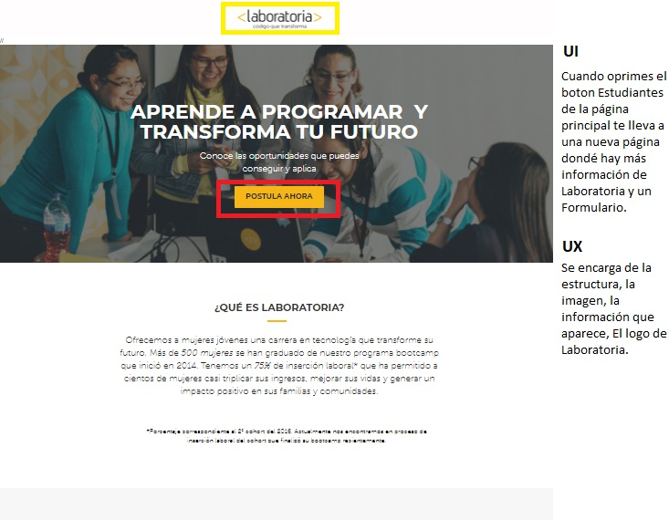
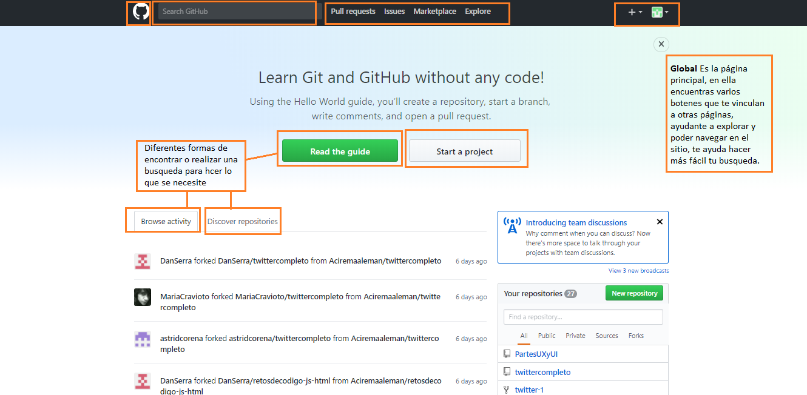
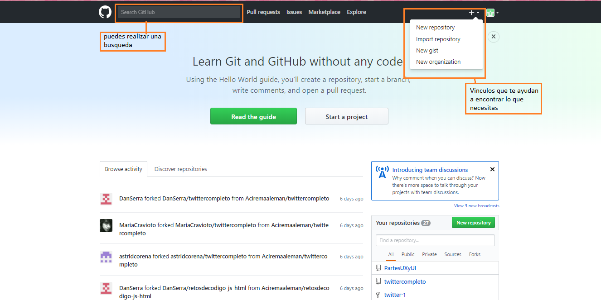
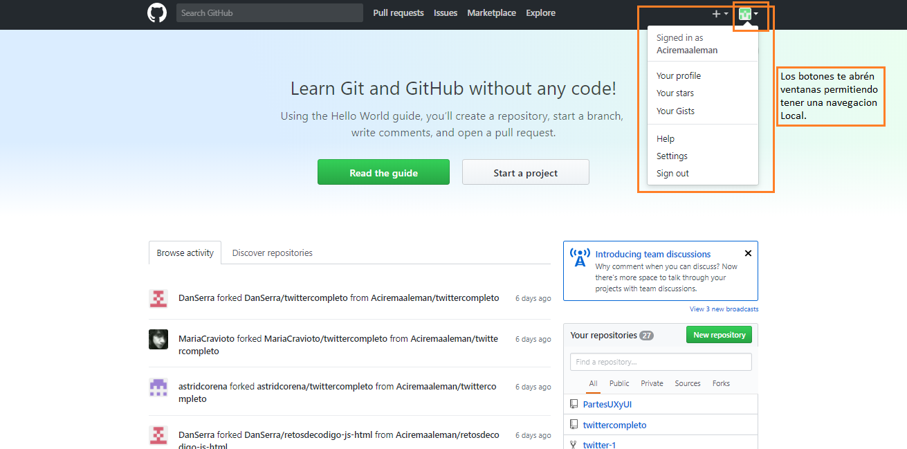
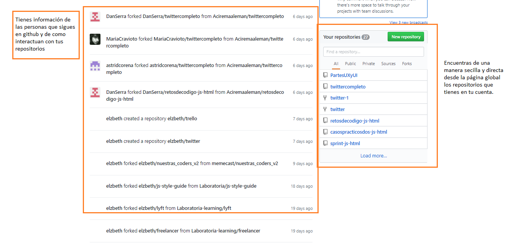
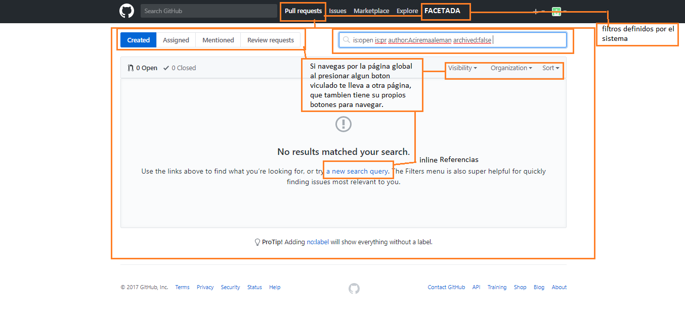
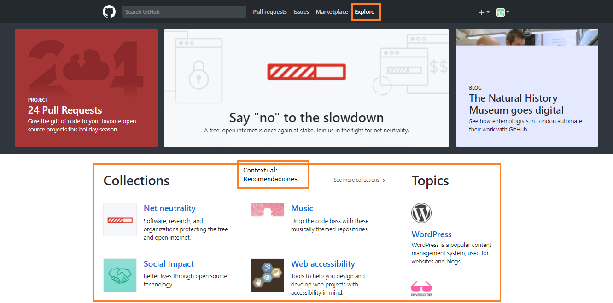

RETO 1
  Elige una web de tu preferencia y explica qué partes conforman el UX y qué partes el UI

LABORATORIA

## UX

Se encarga de:

. Estructura de la página.
. Localización de botones dentro de la esctructura.
. Localización de redes dentro de la estructura.
. Tipo de imagenes y lugar en el que tienen que ir.

## UI

Se encarga de:

. Diseño de la Estructura de la página.
. Color de la página y de los elementos.
. Tipo y color de fuente.
. Diseño de los botones.
. Funcionalidad de los Botones.
. Funcionalidad del cuestionario.

RETO 2
 Identifica los elementos de navegación en los siguientes sites

GITHUB

## NAVEGACIÓN

La navegación es la facilidad que tiene el ususario para poder dezplazarse por la página web y todas las páginas que contiene
una misma página web.
Haciendo que el usuario no se pierda en la página y pueda reconocer donde esta, donde ha estado  y a donde puede o quiere ir.

